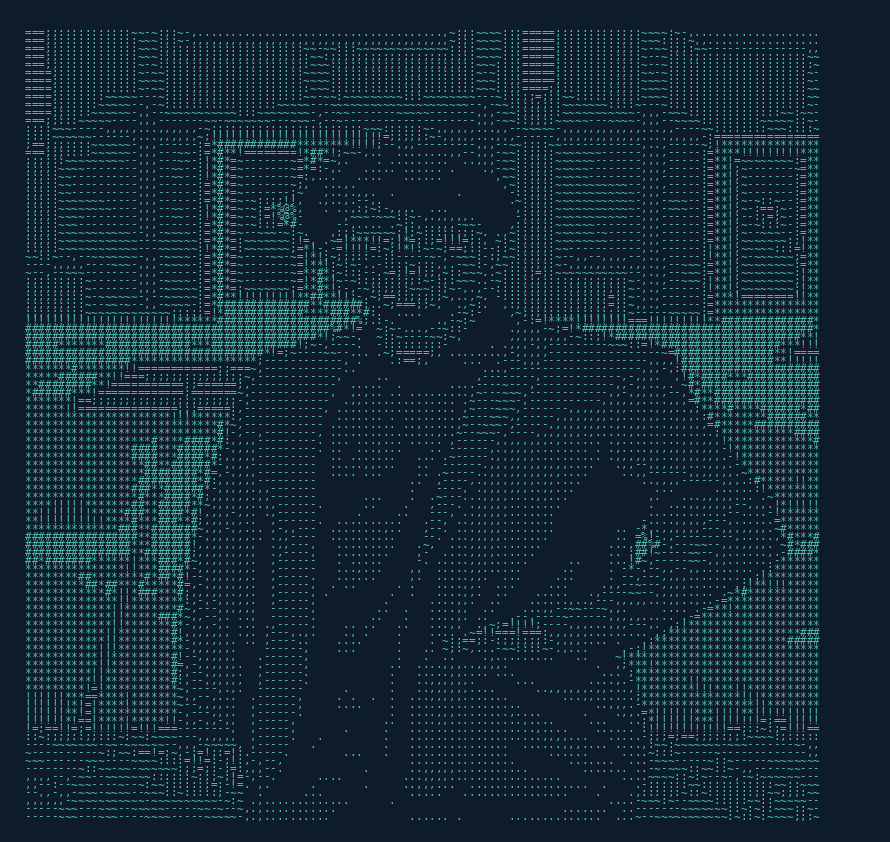

<p align="center">
  
</p>

<p align="center">
  
</p>

<p align="center">
  <a href="https://linkedin.com/in/gabrielsuarezz"></a>&nbsp;
  <a href="mailto:gabrielsc0513@gmail.com"></a>&nbsp;
  <a href="https://gabrielsuarez.dev"></a>&nbsp;
  
</p>

---

## 👋 About Me

```yaml
name: Gabriel Suarez
location: Miami, FL
education:
  school: Florida International University
  degree: B.S. Computer Science
  gpa: 3.5 / 4.0
  graduation: July 2026
focus:
  - Artificial Intelligence & Machine Learning
  - Computer Vision
  - Full-Stack Development
status: 🟢 Open to Opportunities
```

<p align="center">
  
  
</p>

---

## 🏆 Hackathon Projects

<table>
<tr>
<td width="50%" valign="top">

### 🥇 Voxtant
**PlutoHacks 2025 — Best Overall Winner**

AI-powered interview coach with real-time feedback on answers, STAR structure, and delivery. Privacy-first on-device emotion detection using computer vision.

`Next.js` `FastAPI` `OpenCV` `MediaPipe` `Gemini`

[](https://github.com/gabrielsuarezz/Voxtant)

</td>
<td width="50%" valign="top">

### 🥇 HeliosAI
**Knight Hacks VIII — MLH Best Use of Arm**

Smart solar tracker with Arduino that physically follows the sun. Features an AI dashboard and conversational voice assistant for sustainable energy education.

`Arduino` `Flask` `Python` `Gemini` `WebSocket`

[](https://github.com/pablomoli/helios)

</td>
</tr>
<tr>
<td width="50%" valign="top">

### 👁️ Shadow Vision
**ShellHacks 2025**

Computer vision system that recognizes hand shadow puppets in real-time. Built a custom ML dataset from scratch and connected it to live TouchDesigner visuals.

`Python` `OpenCV` `MediaPipe` `scikit-learn` `Docker`

[](https://github.com/pablomoli/Shadow-Vision)

</td>
<td width="50%" valign="top">

### 🎥 ViewGuard
**SharkByte 2025**

Real-time CCTV theft/vandalism detection across multiple cameras using AI. Features instant alerts and a conversational voice assistant interface.

`Next.js` `YOLOv8` `TensorFlow.js` `Gemini` `ElevenLabs`

[](https://github.com/LeoSadoun/ViewGuard)

</td>
</tr>
</table>

---

## 🛠️ Tech Stack

<p align="center">

**Languages**


**AI & Machine Learning**


**Frontend & Backend**


**Databases & Tools**


</p>

---

## 📊 Activity

<p align="center">
  
</p>

---

<p align="center">
  
</p>

---

<p align="center">
  <sub>💡 Always open to collaborating on innovative projects — let's build something amazing!</sub>
</p>
