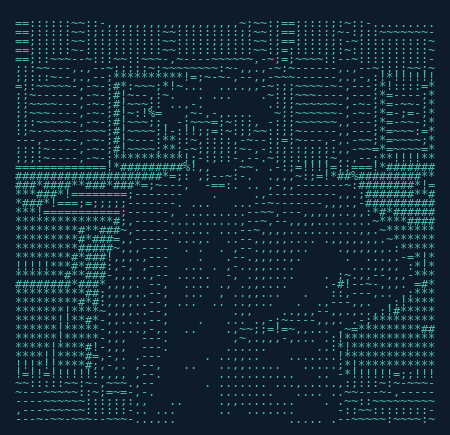

<p align="center">
  
</p>

<p align="center">
  
</p>

<p align="center">
  <a href="https://linkedin.com/in/gabrielsuarezz"></a>&nbsp;
  <a href="mailto:gabrielsc0513@gmail.com"></a>&nbsp;
  <a href="https://gabrielsuarez.dev"></a>&nbsp;
  
</p>

---

```javascript
const gabriel = {
    location: "Miami, FL",
    education: "B.S. Computer Science @ FIU",
    gpa: "3.5 / 4.0",
    graduation: "July 2026",
    focus: ["AI/ML", "Computer Vision", "Full-Stack Development"],
    status: "🟢 Open to Opportunities"
};
```

<p align="center">


</p>

---

## 🏆 Hackathon Projects

| Project | Award | Description | Tech |
|---------|-------|-------------|------|
| **[Voxtant](https://github.com/gabrielsuarezz/Voxtant)** | 🥇 Best Overall | AI interview coach with real-time feedback & on-device emotion detection | Next.js, FastAPI, OpenCV, Gemini |
| **[HeliosAI](https://github.com/pablomoli/helios)** | 🥇 MLH Best Arm | Solar tracker with Arduino + AI dashboard + voice assistant | Arduino, Flask, Gemini |
| **[Shadow Vision](https://github.com/pablomoli/Shadow-Vision)** | ShellHacks | CV hand shadow puppet recognition with custom ML dataset | Python, OpenCV, MediaPipe |
| **[ViewGuard](https://github.com/LeoSadoun/ViewGuard)** | SharkByte | Real-time CCTV theft detection with multi-camera AI | Next.js, YOLOv8, TensorFlow.js |

---

## 🛠️ Tech Stack

<p align="center">


</p>

---

<p align="center">

</p>
